# My Django Project: Cass Galaar

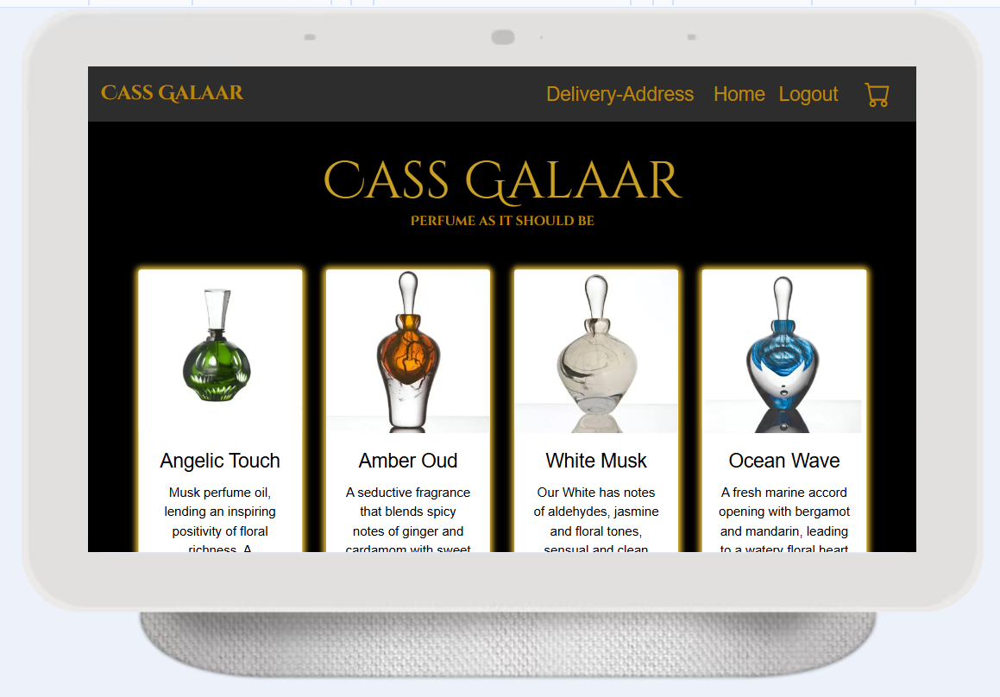

Visit the deployed site: [Cass Galaar](https://cass-galaar-10e10382d0c4.herokuapp.com/)


## CONTENTS

- [User Experience](#user-experience-ux)

  - [User Stories](#user-stories)

- [Design](#design)

  - [Colour Scheme](#colour-scheme)
  - [Typography](#typography)
  - [Wireframes](#wireframes)
  - [Features](#features)

    - [Register Form](#register-form)
    - [Add Delivery Address](#add-delivery-address)
    - [Home Page](#home-page)
    - [Perfume Details Page](#perfume-details-page)
    - [Shopping Cart Page](#shopping-cart-page)
    - [Stripe](#stripe)
    - [Payment Feedback Pages](#payment-feedback-pages)
    - [Login and Logout pages](#login-and-logout-pages)

  - [Future Implementations](#future-implementations)
  - [Accessibility](#accessibility)

- [Technologies Used](#technologies-used)

- [Deployment & Local Development](#deployment-&-local-development)

  - [Deployment](#deployment)
  - [Local Development](#local-development)
    - [How to Fork](#how-to-fork)
    - [How to Clone](#how-to-clone)

- [Testing](#testing)
  - [Solved Bugs](#solved-bugs)
- [Credits](#credits)
  - [Code Used](#code-used)
  - [Personal Overview](#personal-overview)

---


## User Experience (UX)

### User Stories

#### First Time Visitor Goals

- I want to see what perfumes are available.
- I want to be able to read about the perfume.
- I want to be able to make an easy purchase.

#### Returning Visitor Goals

- I want to see if any new perfumes have been added.
- I want to see if my chosen perfumes are still in my shopping cart.

---

## Design

### Colour Scheme

The main colour theme for this site is Black and Gold — portraying the site as luxurious for enticement.

```css
.gold-1 {
  color: #caa126 !important;
}

.gold-2 {
  color: #b8860b !important;
}
```

- I have used `color: #caa126` for headings and buttons.
- I have used `color: #B8860B` for all other texts.
- I have used `background-color: black;` for the body of each page and text that are on white background cards.
- I have used `background-color: rgb(45, 45, 45)` for the navbar to stand out a little bit from the body

  

### Typography

The typography of site has been carefully chosen to provide a clean, modern, and highly readable experience for users. The website uses a google font called .cinzel-regular for headings and gold text. The site also uses the Arial, Helvetica, and sans-serif font families for consistency and accessibility across all devices and platforms.

```css
body {
  font-family: Arial, Helvetica, sans-serif;
}
```


Key Reasons for Choosing This Typography:

- Cinzel: A very fancy font but very clear to read font. It suits the luxurious intent without compromising readability. It also give an Arabic feel which is the style of the perfume oils.

- Arial: A widely used, legible sans-serif typeface, known for its simplicity and modern look. It ensures a clean and professional aesthetic throughout the website.

- Helvetica: A classic sans-serif typeface, used as a fallback to ensure a high-quality user experience on systems where Arial might not be available.

- Sans-serif: This acts as a final fallback for any system that does not support the previous two fonts, ensuring text remains clear and readable.

By using these fonts, we ensure that site maintains a consistent appearance across different browsers and devices, providing a reliable and accessible interface for all users.

### Wireframes

Wireframes were created using Figma.

- [Register Form](media/images/readme_images/wireframe-reg.png)
- [Delivery Address Form](media/images/readme_images/wireframe-address.png)
- [Home Page](media/images/readme_images/wireframe-home.png)
- [Perfume Details](media/images/readme_images/wireframe-details.png)
- [Shopping Cart](media/images/readme_images/wireframe-cart.png)
- [Payment Success](media/images/readme_images/wireframe-payment1.png)
- [Payment Cancelled](media/images/readme_images/wireframe-payment2.png)
- [Login Page](media/images/readme_images/wireframe-login.png)
- [Logout Page](media/images/readme_images/wireframe-logout.png)

### Database Schema

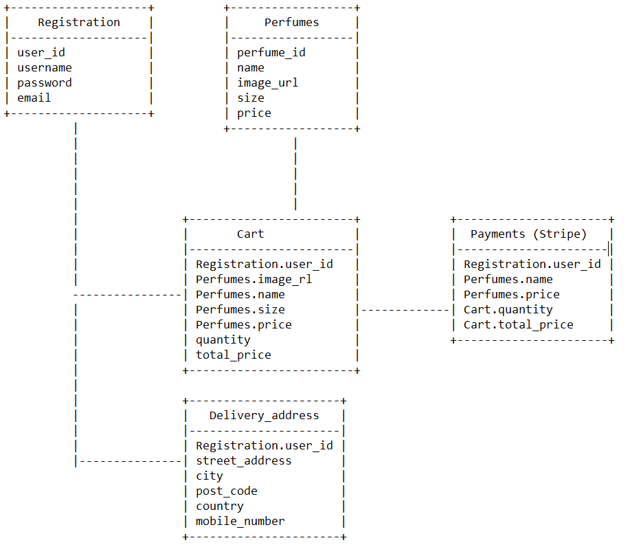

1. Registration Table
   Table Name: Registration
   Purpose: Stores user credentials and basic information.

Key Fields:
user_id: Unique identifier for each user (Primary Key).
username: Unique username for the user.
password: User's password.
email: Unique email address for user communication.

2. Perfumes Table
   Table Name: Perfumes
   Purpose: Stores details about the perfumes available for sale.

Key Fields:
perfume_id: Unique identifier for each perfume (Primary Key).
name: Name of the perfume.
image_url: Link to the perfume's image.
size: Size of the perfume.
price: Cost of the perfume.

3. Cart Table
   Table Name: Cart
   Purpose: Represents the user's shopping cart, linking users with the perfumes they wish to purchase.

Key Fields:
Registration.user_id: Foreign Key referencing the Registration table.
Perfumes.image_url, Perfumes.name, Perfumes.size, Perfumes.price: These fields are included to provide context about the items in the cart.
quantity: Number of each perfume the user wishes to purchase.
total_price: Calculated total price based on the quantity and price of perfumes in the cart.

4. Payments Table (Stripe)
   Table Name: Payments
   Purpose: Allows payment transactions processed through Stripe — allowing users to purchase the perfumes.

Key Fields:
Registration.user_id: Foreign Key referencing the Registration table, linking payments to users.
Perfumes.name, Perfumes.price: Information about the perfume being purchased.
Cart.quantity: The quantity of the perfume purchased.
Cart.total_price: Total price for the transaction.

5. Delivery Address Table
   Table Name: Delivery_address
   Purpose: Stores delivery information for users.

Key Fields:
Registration.user_id: Foreign Key referencing the Registration table, linking addresses to users.
street_address: The street address for delivery.
city: The city of the delivery address.
post_code: The postal code for the delivery.
country: Country of the delivery address.
mobile_number: Contact number for delivery communication.

### Features

The website is comprised of 3 main pages (Home page, Perfume details page, and Shopping cart page), along with a Registration page, Login and Logout page, Add a delivery address and Edit delivery address page, and the payment page is a link using Stipe's payment system.

All pages on the website are responsive and have:

- A favicon in the browser tab.

  

- A logo in the top left. This logo also acts as a link back to the index page or a refresh button in case there were any issues.

  

- A nav bar with two nav links for unregistered users: Register and Login

  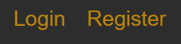

- The nav bar has 4 nav links for registered users: Delivery-Address, Home, Logout and a shopping cart icon.

  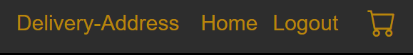

#### Register Form

The user registration form is an essential feature of the platform, allowing new users to create accounts. It is designed to collect critical information securely and ensure a smooth onboarding experience. The form captures details such as the username, email address, and password, with a confirmation field to verify the password entry. Validation mechanisms ensure all fields are completed correctly. The username and email must be unique, while passwords must meet strength requirements for security. Users receive instant feedback if there are errors, such as missing fields, duplicate information, or password mismatches.

Once the user submits the form, the data is securely processed and stored in the database. If the information is valid, a new account is created. Upon successful registration, the user is redirected to the add delivery address page and automatically logged into their new account. This form ensures a balance between user convenience and robust security measures.

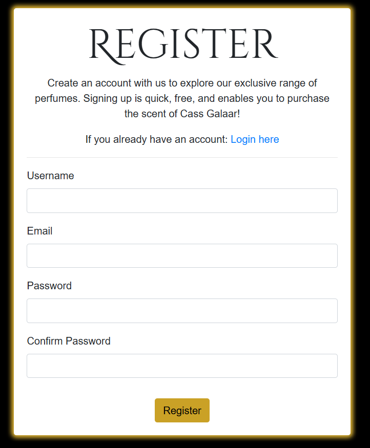

#### Add Delivery Address

The add delivery address form is a feature that allows users to input and save their delivery address information to ensure accurate and efficient order fulfillment. This form collects essential details, including the street address, city, postal code, country, and an optional phone number. Each field is clearly labeled, providing users with guidance on the required input.

Validation is applied to ensure the data is accurate. Fields such as street address, city, postal code, and country are mandatory, while the phone number is validated to confirm it matches the expected format. Error messages are displayed if any field is missing or incorrectly formatted, helping users correct mistakes before submission.

Once the form is completed and submitted, the information is securely processed and stored in the database. Users can later update their saved address if needed via the navbar element which shows the form again but prepopulated with the user's submitted info and with a header to say it's for edditing the address. This form is designed to streamline the checkout process by preloading saved addresses, ensuring a seamless and user-friendly experience. It emphasizes simplicity, accuracy, and functionality, enhancing user satisfaction while supporting operational efficiency. Users are then redirected to the home page which displays all perfumes for purchasing.

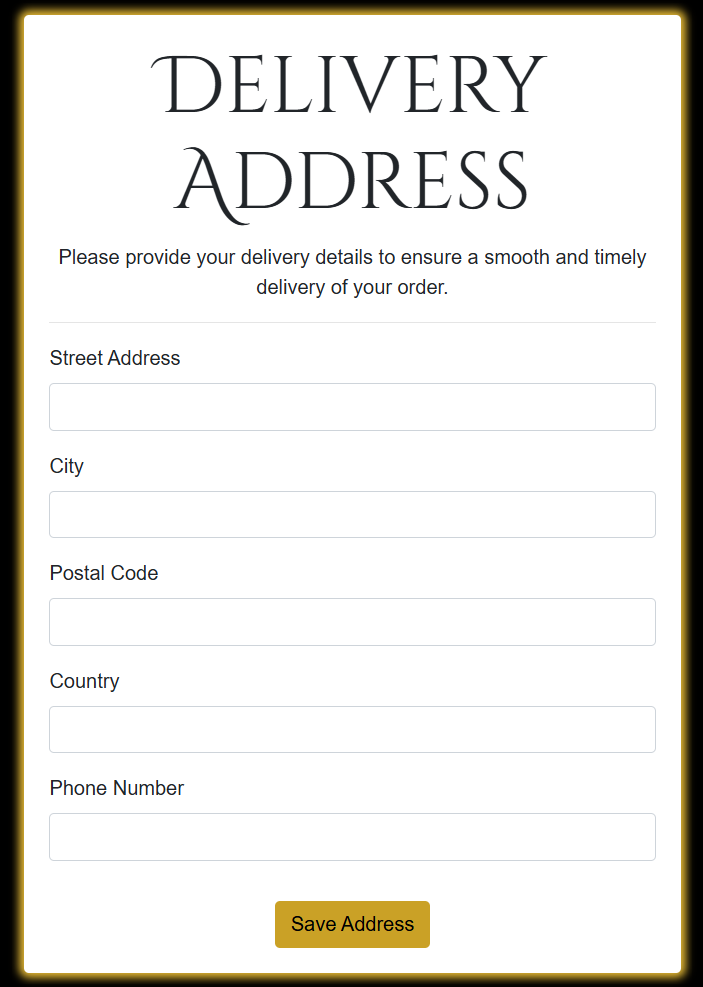

#### Home Page

The home page has the main title of the shop "Cass Galaar" with the slogan beneath it; "Perfume as it should be"
The home page serves as the main shopping page displaying all the available perfumes for sale being displayed as cards with images. The perfume product cards are designed with interactive hover effects that enhance the user experience and indicate the selectability of each product. The hover effects are intuitive and provide immediate feedback, making it easy for users to navigate through the available fragrances.

The hover effect draws attention to the product, inviting users to click and explore further, leading them seamlessly to the perfume details page. This feature ensures an engaging and smooth navigation experience, enhancing the overall usability of the site and encouraging deeper exploration of the perfume offerings.

All the nav links in the header and the footer itself is from the base file which is extended to every page of the site.


#### Perfume Details Page

The perfume details page offers a comprehensive and user-friendly view of the selected fragrance, designed to provide all the essential information in a clean and organized layout. The page has the image of the selected perfume and the perfume's name and a detailed description, giving users a deeper understanding of its scent profile, ingredients, and overall appeal.

In addition to the product information, the page includes an intuitive option to select the desired size of the perfume, with choices for 25 ml, 50 ml, and 75 ml bottles. This feature allows users to easily customize their purchase according to their preferences, and the customer can select how many units of the perfume they want with a display of the price of a single unit.

A clearly visible "Add to Cart" button provides a seamless transition to the shopping cart, enabling users to effortlessly add the selected perfume and proceed with their shopping experience.


#### Shopping Cart Page

The shopping cart page presents a clear and organized list of the items added to the cart, with each product displayed in its own card. Each item card includes essential details such as the perfume name, selected size, quantity, the total price for that quantity and a button to remove from the cart. The cart states that it is empty when it has no items in the list. This layout ensures users can easily review their selections and make adjustments as needed.

At the bottom of the page, the total price of all items in the cart is displayed prominently, giving users a clear overview of their total purchase cost. A "Proceed to Payment" button is also featured, directing users to the secure payment system hosted by Stripe. This button allows for a smooth and seamless transition to the checkout process, providing a straightforward path to finalize the purchase.

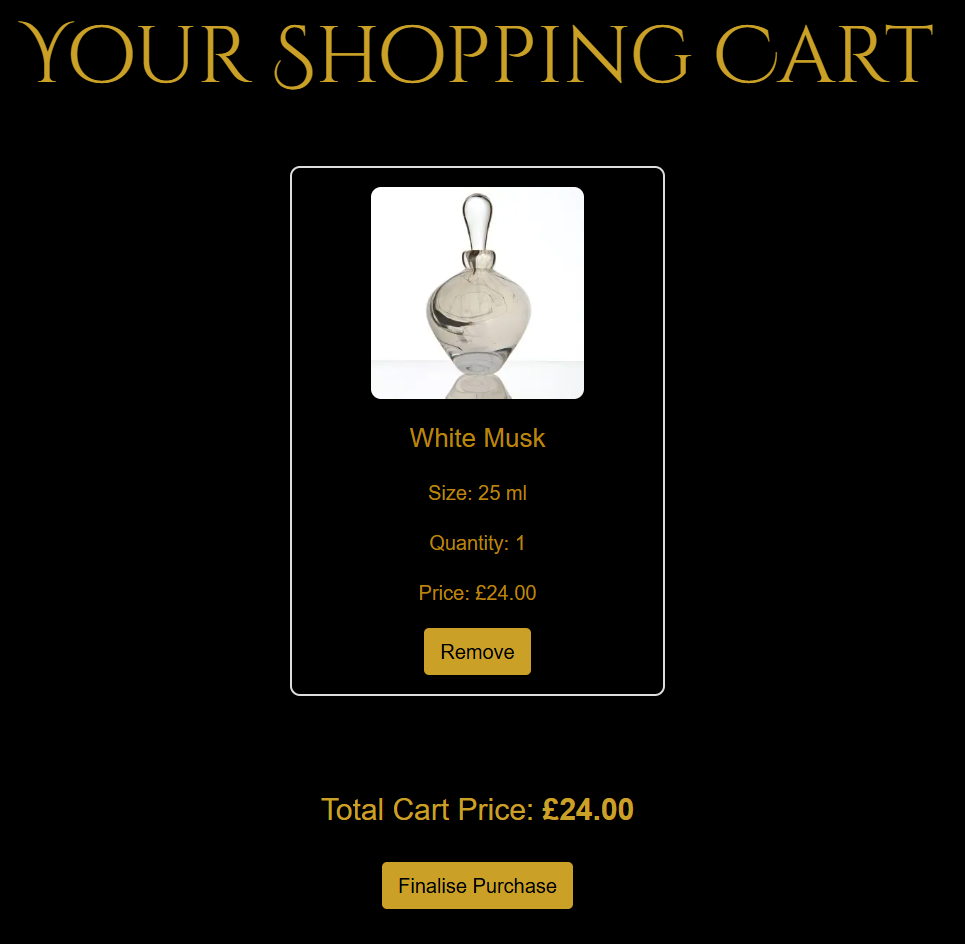

#### Stripe

The payment page is designed to provide a secure and seamless checkout experience for users. On the left side of the page, users can easily review the details of their selected item(s), including perfume and price, ensuring they are ready to complete their purchase. This section provides a clear summary of the order, helping users confirm the items they are paying for.

On the right side, the Stripe payment gateway is integrated, allowing users to securely enter their payment details, including credit or debit card information. The payment form is user-friendly and straightforward, guiding users through the process with clear instructions. Once payment details are entered, users can confidently complete their purchase, knowing their transaction is processed securely through Stripe.

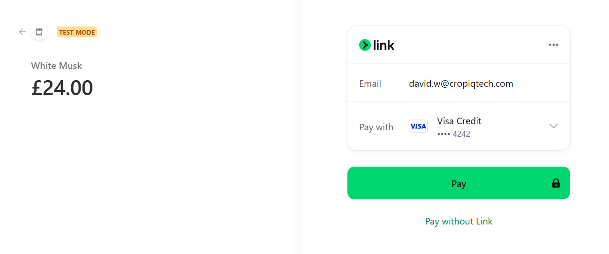

#### Payment Feedback Pages

The payment confirmation page provides users with a clear and straightforward message about the status of their transaction. If the payment is successful, the page will display a simple "Payment Successful" message, along with a brief thank-you note and an option to continue browsing, reassuring users that their purchase has been processed successfully.

If the payment is not successful, the page will display a "Payment Cancelled" message, along with a prompt to try again. Users are encouraged to check their payment details or contact support if necessary. This page ensures users are informed of the outcome of their transaction in a simple, direct, and user-friendly manner, offering clarity regardless of the payment result.

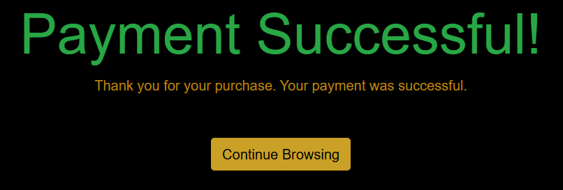
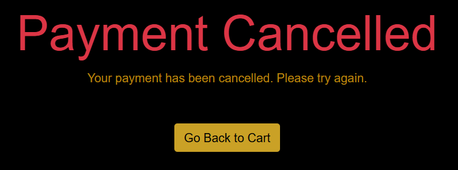

#### Login and Logout Pages

The login page is designed to provide a simple and efficient way for users to access their accounts. It features a straightforward form with fields for the username and password, allowing users to securely log in to their accounts. The form is clean and easy to navigate, ensuring a smooth login process with minimal distractions.

The logout page provides a clear message confirming that the user has successfully logged out of their account. It also includes a prompt with a blue, clickable link that reads "Log in again," allowing users to easily return to the login page if they wish to sign in again. The logout page is simple, focusing on the confirmation of the logout action and providing an intuitive link for easy navigation back to the login page.

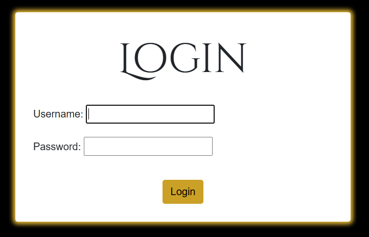
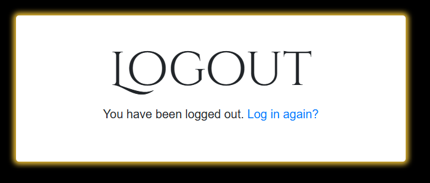

### Future Implementations

In future implementations I would like to:

1. Integrate the address form only when the user decides to pay.
2. Add a 'pay now' button instead of a single button that goes straight to the shopping cart (so the user can add many before being forced to got to the cart)
3. Allow the user to contact me via email to raise any concerns or suggestions.
4. Allow users to search explicitely for male or female as there's a catogory in the data model for that.

### Accessibility

I have been mindful during coding to ensure that the website is as accessible friendly as possible. This has been achieved by:

- Using semantic HTML.
- Using a hover state on all buttons and links on the site to make it clear to the user if they are hovering over a button.
- Choosing a sans serif type font for the site - these fonts are suitable for people with dyslexia.
- Ensuring that there is a sufficient colour contrast throughout the site.
- Ensuring that all nav links and buttons are keyboard focusable.

For the input fields on the form, I used the `label` tag with the `for` attribute. This makes it easier for users, especially for those with motor impairments or those who might have difficulty clicking on small targets, to interact with the input field.

```html
<div class="form-group">
  <label for="{{ form.postal_code.id_for_label }}">Postal Code</label>
  <input
    type="text"
    name="postal_code"
    class="form-control"
    id="{{ form.postal_code.id_for_label }}"
    required
  />
</div>
```

---

## Technologies Used

- [**HTML5**](https://developer.mozilla.org/en-US/docs/Web/Guide/HTML/HTML5)

  - The project uses **HTML5** to create the basic elements and content of my website.

- [**CSS3**](https://developer.mozilla.org/en-US/docs/Web/CSS/CSS3)

  - The project uses **CSS3** to add custom styles to the elements and content of my website.

- [**Bootstrap v4.6.2**](https://getbootstrap.com/)

  - The project uses **Bootstrap v4.6.2** to add a responsive grid system, prebuilt components, plugins built on jQuery, and Bootstrap styles to my website, before adding my custom styles.

- [**jQuery**](https://jquery.com)

  - The project uses **jQuery** to simplify DOM manipulation. This is the standard jQuery that is built with Bootstrap components.

- [**JavaScript**](https://www.javascript.com/)

  - The project uses **JavaScript** for controlling the length of time that the flash image remains visible.

- [**Python**](https://www.python.org/)

  - The project uses **Python**, a versatile and widely-used programming language, to handle the backend logic and server-side functionality of the application. Python's simplicity and readability have made it ideal for this project, allowing for rapid development and efficient problem-solving.

- [**Django**](https://www.djangoproject.com/)

  - The project is built using **Django**, a high-level Python web framework that encourages rapid development and clean, pragmatic design. Django provides a robust set of tools for handling everything from URL routing to database management, making it the perfect framework for building scalable and secure web applications.

- [**Jinja2**](https://jinja.palletsprojects.com/)

  - The project leverages **Jinja2**, the templating engine used by Django, to dynamically generate HTML content. Jinja2 allows for the efficient rendering of templates with backend data and simplifies the process of creating clean, dynamic web pages.

- [**Figma Wireframes**](https://www.figma.com/)

  - Using **Figma Wireframes** is very beneficial to gauge what you will add and where you will place them on your pages, providing a good visual layout to ensure nothing is missed and everything is properly organized.

- [**Visual Studio Code**](https://code.visualstudio.com/)

  - I've used **Visual Studio Code** as the development environment to write the code for my website.

- [**Git**](https://git-scm.com/)

  - I've used **Git** as a version control system to regularly add and commit changes made to the project in Cloud9, before pushing them to GitHub.

- [**GitHub**](https://github.com/)

  - I've used **GitHub** as a remote repository to push and store the committed changes to my project from Git. I've also used GitHub Pages to deploy my website in a live environment.

- [**Chrome DevTools**](https://developer.chrome.com/docs/devtools/)

  - I've used **Chrome DevTools** to view my website from different screen sizes and to play around with the HTML and CSS before deciding what code to implement.

- [**Lighthouse**](https://developers.google.com/web/tools/lighthouse)

  - I utilized **Lighthouse** to conduct comprehensive tests on my website, examining performance, accessibility, best practices, and SEO. It generates detailed reports and optimization suggestions to enhance overall website quality and user experience.

- [**W3C Markup Validation**](https://validator.w3.org/)

  - Through using **W3C Markup Validation**, I ensured conformity to W3C standards for HTML and CSS. I've utilized this tool to verify and rectify HTML issues, ensuring improved cross-browser compatibility and adherence to web standards.

- [**pgAdmin 4**](https://www.pgadmin.org/)

  - I used **pgAdmin 4** to manage my PostgreSQL database. It provided an intuitive interface to monitor database activity, execute queries, and perform necessary operations such as creating a new server, linking it to the database, and managing data entries efficiently.

- [**ImageBB**](https://imgbb.com/)

  - I utilized **ImageBB** to host the images for my website. By uploading images to ImageBB and generating direct URLs, I ensured that the images were accessible and displayed correctly on the deployed site, especially when running on platforms like Heroku.

---

## Deployment & Local Development

### Deployment to Github

The hosting platform that I've used for my project is GitHub Pages and Heroku. To deploy my website to GitHub pages, I used the following steps:

1. Press `ctrl+'` in VS Code which opens the integrated terminal in the root directory of the project folder.

2. Initialise Git using the `git init` command.

3. Add all files to the staging area using the `git add .` command.

4. Commit the files using the `git commit -m "First commit"` command.

5. Create a new repository in GitHub called 'Milestone-3-Code-Institute'.

6. Copy the code with the origin that GitHub provides and paste into the terminal window:

   ```
   git remote add origin https://github.com/david-walters/final-project-code-institute.git

   git push -u origin main

   ```

### Deployment to Heroku

To deploy the project to **Heroku** using the **Heroku GUI**, I followed these steps:

1. Ensure all necessary dependencies are listed in the `requirements.txt` file. This file tells Heroku which packages to install. If it's missing, you can generate it by running this command in your terminal:

```bash
    pip freeze > requirements.txt

```

2. Create a Procfile in the root directory of the project to tell Heroku how to run the application. The Procfile contains the following:

```bash
    web: gunicorn run:app

```

3. Make sure that your project files, including requirements.txt and Procfile, are committed to your repository:

```bash
    git add .
    git commit -m "Prepared project for Heroku deployment"

```

4. Log in to Heroku by going to https://heroku.com and signing in.

5. Once logged in, click on the New button in the Heroku Dashboard and select Create New App.

6. Choose a unique app name, select the region closest to you, and click Create App.

7. In the app dashboard, go to the Deploy tab.

8. Under the Deployment method, select GitHub.

9. Connect your Heroku app to the GitHub repository by searching for your repository name and clicking Connect.

10. Scroll down to the Automatic deploys section and choose the branch you want to deploy (usually main or master). Then, click Enable Automatic Deploys or Deploy Branch if you're deploying manually.

11. After deployment, Heroku will automatically build and deploy your app. Once it’s done, click the View button at the bottom of the page to see your live application.

12. Ensure that environment variables such as SECRET_KEY, DATABASE_URL, and others are set up correctly in the Settings tab by clicking Reveal Config Vars and adding the appropriate key-value pairs.

13. Finally, run migrations on Heroku to create the necessary database structure:

### Local Development

#### How to Fork

To fork the repository:

1. Log in (or sign up) to Github.
2. Go to the repository for this project, [david-walters/Final-Project-Code-Institute](https://github.com/david-walters/final-project-code-institute)
3. Click the Fork button in the top right corner.

#### How to Clone

To clone the repository:

1. Log in (or sign up) to GitHub.
2. Go to the repository for this project, [david-walters/Final-Project-Code-Institute](https://github.com/david-walters/final-project-code-institute)
3. Click on the code button, select whether you would like to clone with HTTPS, SSH or GitHub CLI and copy the link shown.
4. Open the terminal in your code editor and change the current working directory to the location you want to use for the cloned directory.
5. Type 'git clone' into the terminal and then paste the link you copied in step 3. Press enter.

---

## Testing

Please refer to [TESTING.md](TESTING.md) file for all testing carried out.

### Solved Bugs

| No  | Bug                                                                                          | How I solved the issue                                                                                                                                                                                    |
| :-- | :------------------------------------------------------------------------------------------- | :-------------------------------------------------------------------------------------------------------------------------------------------------------------------------------------------------------- |
| 1   | No images showing on Heroku: The images were not displaying on the deployed site.            | I solved this by hosting the images on ImageBB and adding their direct URLs to the database. This ensured that the images were accessible on Heroku.                                                      |
| 2   | Duplicate listings of each perfume: The database had multiple instances of the same perfume. | I resolved this by creating a new server in pgAdmin4, linking it to the database provided by Code Institute, manually deleting the duplicates, and re-populating the database with the corrected entries. |
|     |

### Unresolved Bugs

I had an issue with selecting larger sizes and reflecting the total price in the cart as the total price was not updating to the larger sizes. I resolved them temporarily by making the larger sizes unselectable with a note saying Out of Stock until it is resolved.

## Credits

### Code Used

I utilised several external resources to complete this project:

- I used Bootstrap v4.6.2 for the responsive grid system, prebuilt components, and styles, which I customized to suit the needs of the project.

- I referred to Django tutorials to properly set up the application, configure the database, and implement routing and views.

- Heroku was instrumental for deployment, and I used their resources to troubleshoot issues and ensure smooth hosting for the app.

### Personal Overview

This project has been a rewarding experience from start to finish. I encountered a few challenges, but each hurdle provided an opportunity to deepen my understanding of Django and deployment environments. Working through these issues gave me a much better grasp of how to manage a full-stack web application.

Overall, I’m proud of the progress I've made in this project, and I look forward to applying the lessons learned here to future projects. It’s been a great journey, and I can’t wait to share more of my work!

Thanks for checking out my project!

:+1:
