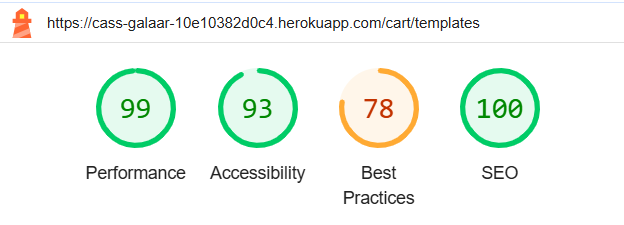

# My Django Project: Cass Galaar — Testing

Visit the deployed site: [Cass Galaar](https://cass-galaar-10e10382d0c4.herokuapp.com/)

---

## CONTENTS

- [AUTOMATED TESTING](#automated-testing)
  - [Standard Automated Test](#standard-automated-tests)
  - [Lighthouse](#lighthouse)
- [MANUAL TESTING](#manual-testing)
  - [Testing User Stories](#testing-user-stories)
  - [Full Testing](#full-testing)
  - [Browser and Device Testing](#browser-and-device-testing)
  - [Manual Feature Testing](#manual-feature-testing)

Testing was ongoing throughout the entire build of this project. During development I made use of the console inside VS-Code to read about the errors that occurred in order to correct them, and the console in Google dev tools and to check the network.

I have gone through each page using google chrome developer tools & Firefox inspector tool to ensure that each page is responsive on a variety of different screen sizes and devices and to ensure that the keyframes also work on different browsers.

---

## AUTOMATED TESTING

### Standard Automated Tests

[W3C](https://validator.w3.org/) was used to validate the HTML on all pages of the website. It was also used to validate the CSS. All the pages had no errors except that the validator didn't understand Jinja templating.

All python files were tested using `pylint`. Through this I fixed lenghty lines, trailing white spaces, applied docstrings where relevent, and prioritised imports.

My JS files was tested using JSHint and returened with zero errors.

---

### Lighthouse

I used Lighthouse within the Chrome Developer Tools to test the performance, accessibility, best practices and SEO of the website.

#### Desktop Results

All pages of the site are achieving a score above 90 except for best practices. The only thing that has impacted the best practices is Stripes use of cookies.

#### Mobile Results

Each page was only impacted by the image loading but still above 80 for everything except for the same issue of cookies due to stripe.

---

## MANUAL TESTING

### Testing User Stories

#### First Time Visitor Goals

| Goals                                        | How are they achieved?                                                                                                                                   |
| :------------------------------------------- | :------------------------------------------------------------------------------------------------------------------------------------------------------- |
| I want to see what perfumes are available.   | The homepage displays a list of perfumes, showcasing all available products with their names, sizes, and prices.                                         |
| I want to be able to read about the perfume. | Each perfume listed on the homepage is linked to a detailed page that provides a description, price, and other product details.                          |
| I want to be able to make an easy purchase.  | A simple "Add to Cart" button is displayed on the perfume detail page, allowing users to select their desired size and quantity and proceed to checkout. |

#### Returning Visitor Goals

| Goals                                                              | How are they achieved?                                                                                                                                                                                                |
| :----------------------------------------------------------------- | :-------------------------------------------------------------------------------------------------------------------------------------------------------------------------------------------------------------------- |
| I want to see if any new perfumes have been added.                 | The homepage can easily be populated through the database which can have many new items if need be                                                                                                                    |
| I want to see if my chosen perfumes are still in my shopping cart. | The shopping cart is accessible from any page, displaying the current items and allowing users to easily check if their chosen perfumes are still in the cart due to being stored in the database with their user id. |

---

### Browser and Responsive Device Testing

Full testing was performed on the following devices and more on Google dev tools:

The site was tested using the following browsers:

- Google Chrome
- Microsoft IE
- Firefox

Additional testing was taken by friends and family on a variety of devices and screen sizes. They reported no issues when visiting and navigating.

### Manual Feature Testing

#### Header/Nav Items

| Feature                       | Expected Outcome                                                                                                                | Testing Performed                          | Result                                                                                    | Pass/Fail |
| ----------------------------- | ------------------------------------------------------------------------------------------------------------------------------- | ------------------------------------------ | ----------------------------------------------------------------------------------------- | --------- |
| Logo - href to Home           | Clicking on the logo should direct the user to the home page                                                                    | Clicked on the logo                        | The user is successfully directed to the home page                                        | Pass      |
| Nav item - Home               | Clicking on the "Home" nav item should direct the user to the home page                                                         | Clicked on the "Home" nav item             | The user is successfully directed to the home page                                        | Pass      |
| Nav item - Login              | Clicking on the "Login" nav item should direct the user to the login page                                                       | Clicked on the "Login" nav item            | The user is successfully directed to the login page                                       | Pass      |
| Nav item - Logout             | Clicking on the "Logout" nav item should direct the user to the logged-out page                                                 | Clicked on the "Logout" nav item           | The user is successfully directed to the logged-out page                                  | Pass      |
| Nav item - Delivery Address   | Clicking on the "Delivery Address" nav item should prepopulate the fields in the form with the authenticated user's credentials | Clicked on the "Delivery Address" nav item | The delivery address fields are successfully populated with the authenticated user's data | Pass      |
| Nav item - Shopping Cart Icon | Clicking on the "Shopping Cart" icon should direct the user to the shopping cart page                                           | Clicked on the "Shopping Cart" icon        | The user is successfully directed to the shopping cart page                               | Pass      |
| Nav item - Register           | Clicking on the "Register" nav item should direct the user to the registration form                                             | Clicked on the "Register" nav item         | The user is successfully directed to the registration form                                | Pass      |
| Nav items' hover state        | On hover, the scale should increase and the text should get brighter                                                            | Hovered over each nav item in the header   | The hover state is applied                                                                | Pass      |

#### Home Page

| Feature                            | Expected Outcome                                                                | Testing Performed              | Result                                                         | Pass/Fail |
| ---------------------------------- | ------------------------------------------------------------------------------- | ------------------------------ | -------------------------------------------------------------- | --------- |
| Perfume Card - Hover Effect        | Hovering over each perfume card should decrease its scale slightly              | Hovered over each perfume card | The hover effect decreases the scale of the card as expected   | Pass      |
| Perfume Card - Clickable           | Clicking on any perfume card should direct the user to the perfume details page | Clicked on a perfume card      | The user is successfully directed to the perfume details page  | Pass      |
| Perfume Details Page - Image       | The perfume details page should display the image of the selected perfume       | Opened a perfume details page  | The image of the selected perfume is correctly displayed       | Pass      |
| Perfume Details Page - Name        | The perfume details page should display the name of the selected perfume        | Opened a perfume details page  | The name of the selected perfume is correctly displayed        | Pass      |
| Perfume Details Page - Description | The perfume details page should display the description of the selected perfume | Opened a perfume details page  | The description of the selected perfume is correctly displayed | Pass      |

#### Perfume Details Page

| Feature         | Expected Outcome                                                                                                                             | Testing Performed                          | Result                                                                                    | Pass/Fail |
| --------------- | -------------------------------------------------------------------------------------------------------------------------------------------- | ------------------------------------------ | ----------------------------------------------------------------------------------------- | --------- |
| Size Selection  | The user should be able to select a size of the perfume                                                                                      | Selected a size from the available options | The selected size is correctly displayed and updated                                      | Pass      |
| Quantity Change | The user should be able to change the quantity of the selected perfume (e.g., increase or decrease the number)                               | Changed the quantity field                 | The quantity is correctly updated and reflected in the cart                               | Pass      |
| Add to Cart     | The user should be able to click an "Add to Cart" button and add the selected perfume with the chosen size and quantity to the shopping cart | Clicked the "Add to Cart" button           | The perfume with the correct size and quantity is successfully added to the shopping cart | Pass      |

#### Shopping Cart Page

| Feature             | Expected Outcome                                                                                                                                | Testing Performed                      | Result                                                                                             | Pass/Fail |
| ------------------- | ----------------------------------------------------------------------------------------------------------------------------------------------- | -------------------------------------- | -------------------------------------------------------------------------------------------------- | --------- |
| Remove Item         | The user should be able to remove items from the cart by clicking the remove button on the item                                                 | Clicked the "Remove" button on an item | The item is successfully removed from the cart                                                     | Pass      |
| Total Price Display | The total price for all the items in the cart should be displayed correctly at the bottom of the page                                           | Viewed the total price                 | The total price is correctly calculated and displayed                                              | Pass      |
| Finalize Purchase   | The user should be able to click a "Finalize Purchase" button and be directed to the payment page, displaying order details and the total price | Clicked the "Finalize Purchase" button | The user is successfully directed to the payment page with order details and total price displayed | Pass      |

#### Payment Feedback Pages

| Feature                                 | Expected Outcome                                                                                       | Testing Performed                 | Result                                                         | Pass/Fail |
| --------------------------------------- | ------------------------------------------------------------------------------------------------------ | --------------------------------- | -------------------------------------------------------------- | --------- |
| Successful Payment - Success Message    | After a successful payment, a page should appear stating the payment was successful                    | Completed a successful payment    | The user is directed to a page confirming successful payment   | Pass      |
| Successful Payment - Home Button        | On the successful payment page, there should be a button that directs the user back to the home page   | Clicked the "Go to Home" button   | The user is successfully directed to the home page             | Pass      |
| Canceled Payment - Cancellation Message | After a canceled payment, a page should appear stating the payment was canceled                        | Canceled the payment process      | The user is directed to a page confirming payment cancellation | Pass      |
| Canceled Payment - Back to Cart Button  | On the canceled payment page, there should be a button that directs the user back to the shopping cart | Clicked the "Back to Cart" button | The user is successfully directed back to the shopping cart    | Pass      |

#### Login Page

| Feature                             | Expected Outcome                                                                                           | Testing Performed                      | Result                                                             | Pass/Fail |
| ----------------------------------- | ---------------------------------------------------------------------------------------------------------- | -------------------------------------- | ------------------------------------------------------------------ | --------- |
| Username and Password Input         | The user should be able to type their username and password into the respective fields                     | Entered username and password          | The username and password fields are functional for input          | Pass      |
| Successful Login - Redirect to Home | If the login is successful, the user should be redirected to the home page                                 | Entered correct username and password  | The user is successfully logged in and redirected to the home page | Pass      |
| Unsuccessful Login - Error Message  | If the login is unsuccessful, an error message should appear stating the issue (e.g., invalid credentials) | Entered incorrect username or password | An error message is displayed indicating login failure             | Pass      |

#### Register Page

| Feature                              | Expected Outcome                                                                                                   | Testing Performed                                   | Result                                                                             | Pass/Fail |
| ------------------------------------ | ------------------------------------------------------------------------------------------------------------------ | --------------------------------------------------- | ---------------------------------------------------------------------------------- | --------- |
| Username, Password, and Email Input  | The user should be able to enter their username, password, and email into the respective fields                    | Entered username, password, and email               | The fields are functional for input                                                | Pass      |
| White Space Removal                  | White spaces should be automatically removed from all fields (username, password, email, mobile number)            | Entered data with spaces in any field               | Spaces are automatically removed and corrected data is displayed                   | Pass      |
| Error Messages by Field              | If the user leaves a field blank or enters incorrect information, an error message should appear next to the field | Left a required field blank or entered invalid data | Error messages appear next to the field of concern (e.g., "Invalid email address") | Pass      |
| Successful Registration - Auto Login | After successful registration, the user should be automatically logged in                                          | Completed successful registration                   | The user is automatically logged in                                                | Pass      |
| Redirect to Add Delivery Address     | After successful registration and login, the user should be redirected to the "Add Delivery Address" page          | Completed successful registration and login         | The user is redirected to the add delivery address page                            | Pass      |

#### Add/Edit Delivery Address Pages

| Feature                                      | Expected Outcome                                                                                                                      | Testing Performed                                       | Result                                                           | Pass/Fail |
| -------------------------------------------- | ------------------------------------------------------------------------------------------------------------------------------------- | ------------------------------------------------------- | ---------------------------------------------------------------- | --------- |
| Form Validation                              | The form should validate that all required fields are filled in (e.g., name, address, city, postcode, mobile number)                  | Left a required field blank                             | An error message appears next to the missing or invalid field    | Pass      |
| White Space Removal                          | White spaces should be automatically removed from all fields (name, address, city, postcode, mobile number)                           | Entered data with spaces in any field                   | Spaces are automatically removed and corrected data is displayed | Pass      |
| Mobile Number Validation                     | The user should be able to enter a mobile number, with validation ensuring only 11 digits, no special characters, and no white spaces | Entered mobile number with special characters or spaces | The error message appears if validation fails (invalid format)   | Pass      |
| Successful Address Submission - Confirmation | After successfully submitting the form, the user should see a confirmation message                                                    | Completed the form and submitted it                     | The user sees a confirmation message                             | Pass      |

#### CRUD Functionality

The website implements full CRUD (Create, Read, Update, Delete) functionality, enabling users to manage their accounts and shopping experience effectively. Users can register a new account, which is the "Create" function, allowing them to enter personal details. Once registered, they can add a delivery address, which is also part of the "Create" functionality, ensuring that their orders are sent to the correct location.

Users are able to view (or "Read") their information, such as their delivery address, shopping cart, and available perfumes for purchase.

If necessary, users can edit (or "Update") their delivery address, which provides flexibility in case they need to change the location for their orders. Additionally, users can add items to their shopping cart, giving them the ability to select products they wish to purchase.

Finally, users can remove items from their shopping cart if they decide not to buy them. This represents the "Delete" functionality, offering the user complete control over their cart's contents.
